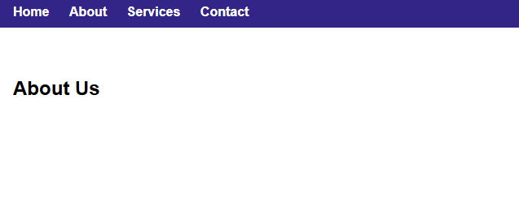

# Sticky Navigation Bar

This project demonstrates how to create a simple and clean sticky navigation bar using HTML and CSS.

## Features

- Sticky behavior (remains at top while scrolling)
- Smooth and responsive layout
- Easy to customize and extend

## 📸 Screenshot

## Technologies Used

- HTML5
- CSS3 (Flexbox, `position: sticky`)

