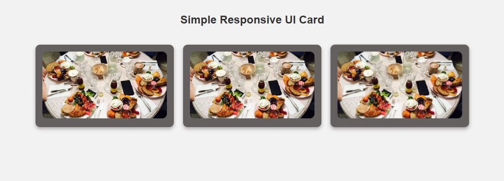

# Responsive UI Card

This is a simple, responsive UI card built using HTML and CSS. It adjusts well to different screen sizes and looks great on phones, tablets, and desktop screens.

## Features

- Responsive layout
- Image with card content
- Hover animation

## How to Use

1. Download the files (`index.html` )
2. Make sure they are in the same folder
3. Open `index.html` in your browser

## Screenshot

