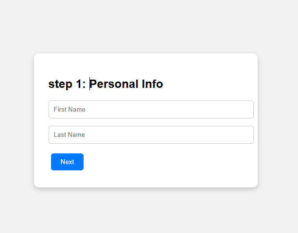

# Multi-Step Form

This is a simple 3-step form built using HTML, CSS, and JavaScript. It allows users to fill in form data one step at a time, improving user experience.

## Features

- Step-by-step navigation
- "Next" and "Back" buttons
- Responsive layout
- JavaScript-powered form logic

## How to Run

1. Download or clone the repo
2. Open `index.html` in your browser
3. Fill out the form and try navigating between steps

