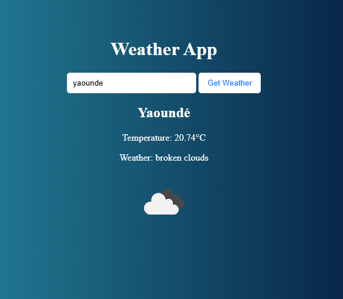

# 🌦️ Weather App

A simple and responsive weather application that allows users to search for real-time weather information by city name. Built using **HTML**, **CSS**, **JavaScript**, and the **OpenWeatherMap API**.

---

## 🚀 Features

- 🌍 Search for any city in the world
- 📡 Get real-time weather data (temperature, condition, icon)
- ⚙️ Uses OpenWeatherMap REST API
- ✅ Error handling for invalid cities
- 💅 Responsive and clean UI

## 📸 Screenshot

## 🛠️ Tech Stack

- **HTML5** – Structure of the webpage  
- **CSS3** – Styling and layout  
- **JavaScript** – Logic and API interaction  
- **OpenWeatherMap API** – For weather data

## 🔑 Get Your API Key

1. Go to [https://openweathermap.org/api](https://openweathermap.org/api)
2. Sign up and log in
3. Go to your profile > API Keys
4. Copy your API key

