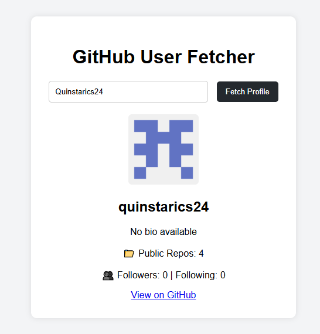

# 🧑‍💻 GitHub User Fetcher

A simple and responsive web application that allows users to search for any GitHub username and fetch their public profile information using the **GitHub REST API**.

Built using **HTML**, **CSS**, and **JavaScript** — no frameworks, no API key needed!

---

## 🚀 Features

- 🔍 Search for any GitHub user by username  
- 👤 Display profile avatar, name, bio, repo count, and followers  
- ❌ Handles invalid usernames and errors gracefully  
- 🧼 Clean, responsive, and beginner-friendly UI  
- ⚡ Uses GitHub’s public REST API with `fetch()` in JavaScript  

## 📸 Screenshot

## 💻 Tech Stack

- HTML5  
- CSS3  
- JavaScript
- GitHub REST API

