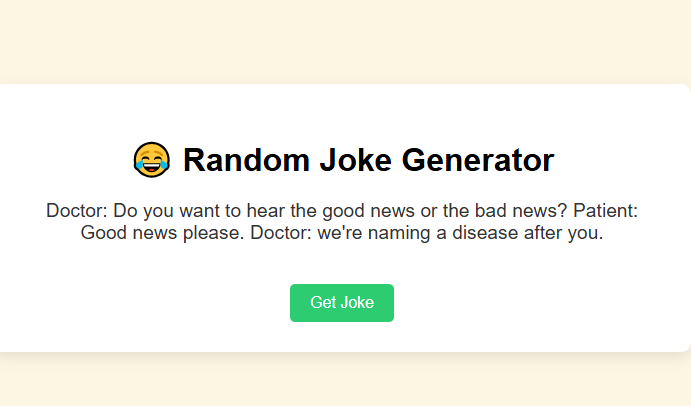

# 🤣 Random Joke Generator

A fun and simple web app that fetches and displays random jokes using the **icanhazdadjoke** public API. Built using **HTML**, **CSS**, and **JavaScript**, it helps you learn how to work with APIs and dynamically update a web page.

---

## 🚀 Features

- 😂 Click a button to generate a new joke
- ⚡ Uses `fetch()` to call a free Joke API
- ✅ Real-time updates without refreshing the page
- ❌ Error handling if the joke fails to load
- 💻 Clean and responsive UI

---

## 📸 Screenshot

---

## 🔧 Tech Stack

- HTML5  
- CSS3  
- JavaScript (ES6)  
- [icanhazdadjoke API](https://icanhazdadjoke.com/api)

---

## 📂 Project Structure

