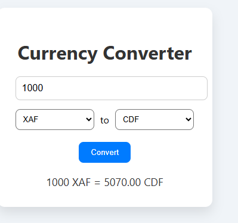

# 💱 Currency Converter

A simple, real-time currency converter using the ExchangeRate API.

## Features

- Converts between any two global currencies
- Real-time exchange rate data
- Beautiful, responsive UI
- Built with HTML, CSS, and JavaScript

## 📸 Preview

## 🌐 API Used

- [ExchangeRate API](https://www.exchangerate-api.com/)
- Free and fast currency conversion rates

## 📁 File Structure

- `index.html` – Frontend HTML structure
- `script.js` – Handles API and conversion logic
- `README.md` – Project guide and documentation

## 🧑‍💻 Created by

- **Quinstarics**
