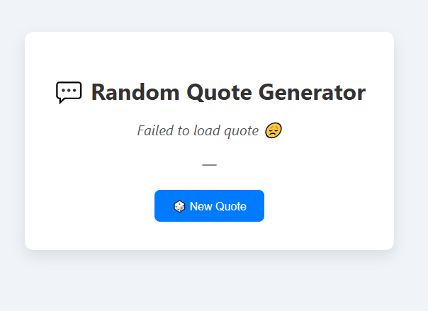

# 💬 Random Quote Generator

This is a simple web app that fetches a random quote from an external API and displays it on the screen.

## 🧩 Features

- Get a random quote with one click
- Uses [Quotable API](https://api.quotable.io/)
- Beautiful and responsive design
- Built using **HTML**, **CSS**, and **JavaScript**

## 📸 Preview

## 🚀 How to Use

1. Clone this repo or download the files.
2. Open `index.html` in your browser.
3. Click the **"New Quote"** button to get a new quote.

## 🔌 API Used

- **Quotable API**:  
  URL: `https://api.quotable.io/random`  
  Free and easy to use, returns JSON quotes with `content` and `author`.

