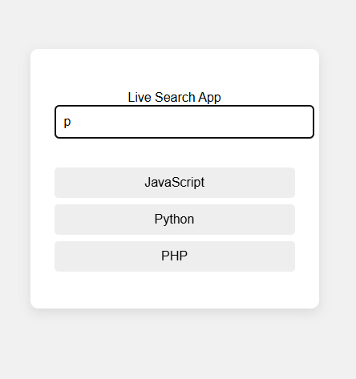

# 🔍 Simple Search App

This is a basic live search app built with HTML, CSS, and JavaScript.

## 💡 Features

- Real-time filtering of items
- Clean and responsive UI
- Vanilla JavaScript – no libraries required
## 📸 Preview

## 📁 Files

- `index.html`: The main structure
- `style.css`: Styling the app
- `script.js`: JavaScript logic for filtering
- `README.md`: Documentation

## 🛠️ How It Works

1. User types in the input box.
2. JavaScript listens for the `keyup` event.
3. It loops through the list of items and compares them with the input.
4. Items that match remain visible; others are hidden.

## 🚀 How to Run

1. Download the files or clone the repo.
2. Open `index.html` in your browser.
3. Type in the search box and see results filter live!

## 🌟 Example Use Cases

- Book or course filtering
- Contact search
- Product search in small web apps
