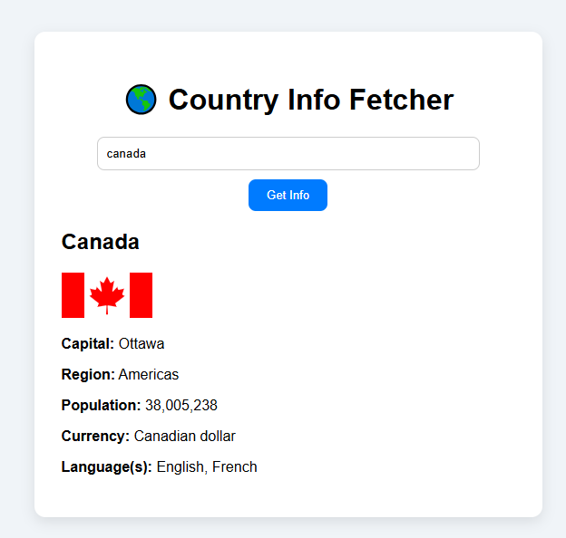

# 🌍 Country Info Fetcher

A simple app that fetches details about any country using the REST Countries API.
## 📸 Screenshot

## 🔧 Features
- Search by country name
- View capital, region, population
- View currency, languages, and flag
- Error handling for invalid inputs

## 🚀 How to Run
1. Clone the repo or copy files
2. Open `index.html` in your browser
3. Type a country name and click "Get Info"

## 📚 Tech Used
- HTML
- CSS
- JavaScript (Fetch API)
- REST API: [https://restcountries.com/](https://restcountries.com/)

