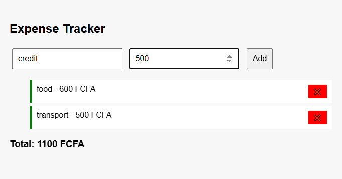

# Expense Tracker (Local Storage)

## 🚀 Overview
A simple web app to track daily expenses using browser localStorage. Built with HTML, CSS, and JavaScript.
## 📸 Preview

## 🧠 Features
- Add and delete expenses
- Automatically calculate total
- Persist data with localStorage

## 📂 How to Run
1. Open `index.html` in any browser.
2. Enter an expense name and amount.
3. Click "Add" to save it.
4. Refresh page – your data is still there!

## 📚 What You Learn
- DOM manipulation
- Storing data in localStorage
- Updating the UI dynamically
- Basic form handling
