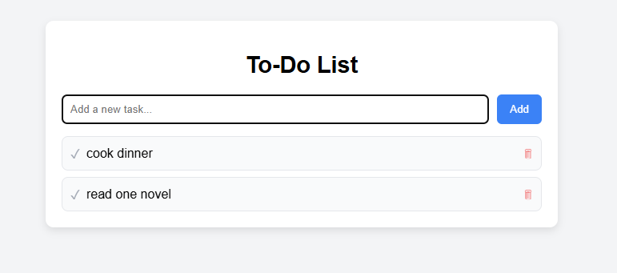

# 📝 To-Do List App

A simple and responsive To-Do List application built with **HTML**, **CSS**, and **JavaScript**.  
This app allows you to add tasks, mark them as completed, and delete them — no frameworks or libraries required.

## 🖼 Screenshot

## ✨ Features
- ➕ **Add tasks** by typing in the input field and clicking "Add" or pressing Enter.
- ✅ **Mark tasks as completed** by clicking the check icon.
- 🗑 **Delete tasks** by clicking the trash icon.
- 🎨 **Responsive design** that works on desktop and mobile.

## 🚀 How to Run
1. **Clone this repository** or download the files.
2. Open `index.html` in your browser.
3. Start adding tasks!

## 🖼 Screenshot

## 📜 License
This project is open source and free to use.

