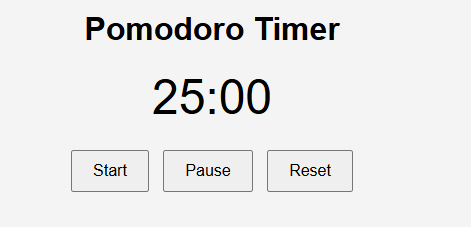

# ⏳ Pomodoro Timer App

A simple Pomodoro Timer built with **HTML**, **CSS**, and **JavaScript**.  
It helps you stay focused using the Pomodoro Technique — 25 minutes of work followed by short breaks.

## ✨ Features
- 25-minute countdown timer for focused work sessions
- Start, Pause, and Reset buttons
- Alert when time is up
- Simple and responsive design

## 🖼 Screenshot

## 🚀 How to Run
1. Clone this repository or download the files.
2. Open `index.html` in your browser.
3. Click **Start** to begin your Pomodoro session.

## 📜 License
This project is open source and free to use.
