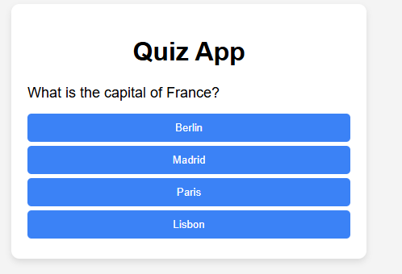

# 🎯 Simple Quiz App

A basic multiple-choice quiz built with **HTML**, **CSS**, and **JavaScript**.  
The app displays questions, lets users select answers, and shows the final score.

## Screenshot

## Features
- Multiple-choice questions
- Shows score at the end
- Simple and responsive design
- Next button navigation

## How to Run
1. Clone this repository or download the files.
2. Open `index.html` in your browser.
3. Answer the questions and view your score.

