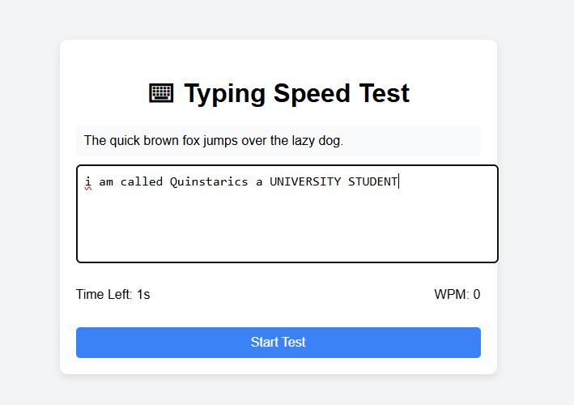

# ⌨ Typing Speed Test App

A simple typing speed test built with **HTML**, **CSS**, and **JavaScript**.  
It measures your **Words Per Minute (WPM)** in a 30-second typing session.

## ✨ Features
- Random quote appears for typing
- 30-second countdown timer
- Calculates WPM (Words Per Minute)
- Simple and responsive design

## 🚀 How to Run
1. Clone this repository or download the files.
2. Open `index.html` in your browser.
3. Click **Start Test** and begin typing.

## 🖼 Screenshot

## 📜 License
This project is open source and free to use.

