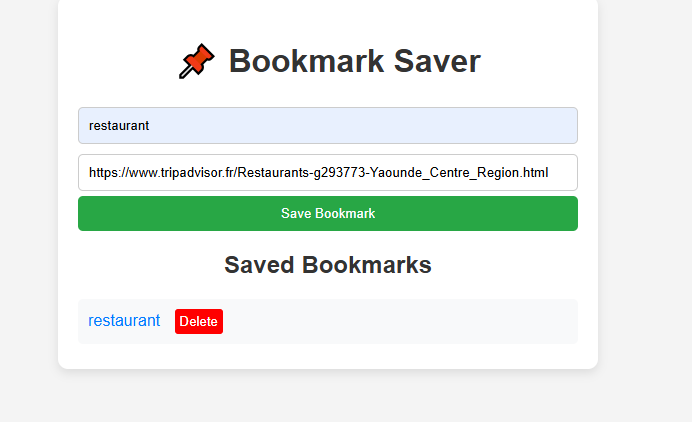

# 📌 Bookmark Saver

A simple web app to save and manage your favorite website bookmarks in your browser using **Local Storage**.

## 🖼 Screenshot

## 🚀 Features
- Add bookmarks with a name and URL
- View saved bookmarks instantly
- Delete unwanted bookmarks
- Data stored locally in browser (no database required)

## 📂 Files
- `index.html` — Main HTML structure
- `style.css` — Styling for the app
- `script.js` — JavaScript logic for saving, fetching, and deleting bookmarks

## 🛠️ How to Use
1. Open `index.html` in your browser.
2. Enter a **website name** and a **URL**.
3. Click **Save Bookmark**.
4. Your saved bookmarks will appear below the form.
5. Click the **Delete** button to remove a bookmark.

## 💡 Technologies Used
- HTML
- CSS
- JavaScript 

## 📜 License
This project is free to use.
