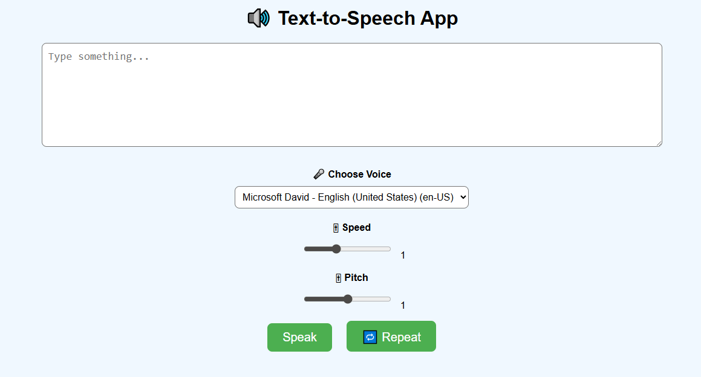

# 🔊 Text-to-Speech App

A simple web app that reads out loud whatever you type! Built with HTML and JavaScript, using the browser's built-in speech system.

---

## 🚀 Features

- Type any text
- Click a button
- The browser speaks it out loud

---

## 💻 How to Use

1. Open `index.html` in any modern browser (Chrome, Edge, Firefox).
2. Type something into the textbox.
3. Click the "Speak" button.
4. 🎧 Listen to the magic!

---

## 📦 How It Works

- Uses the **Web Speech API**.
- The browser reads text using `SpeechSynthesisUtterance`.
- No internet connection needed once opened!

---

## 🛠 Requirements

- A modern browser (Chrome is best)
- No downloads or installs needed

---

## 🙋‍♂️ Author

Ngwina Quin
