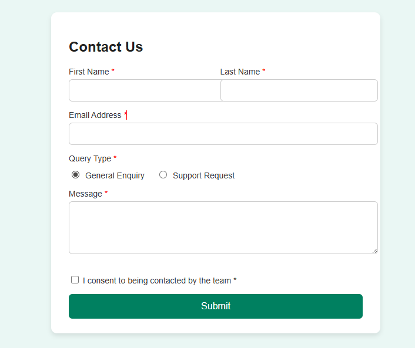

 Contact Form Webpage

This project is a simple *Contact Form Webpage* built using *HTML & CSS*.  
It is fully responsive and includes input validation, styled form fields, radio buttons, and a checkbox for consent.

 Features
- Responsive contact form design  
- Two-column layout for first & last name fields  
- Email validation  
- Query type selection (radio buttons)  
- Message text area  
- Consent checkbox  
- Styled submit button  

 Screenshot

Technologies Used
- HTML5  
- CSS3  
