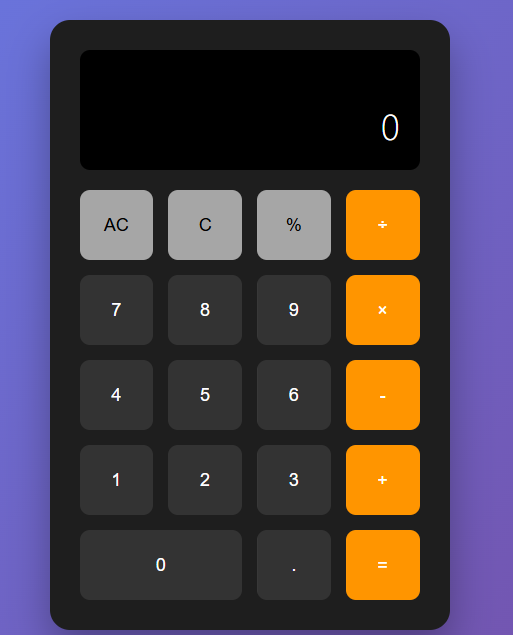

# 🧮 Professional Calculator

This is a fully functional, professional-looking calculator built with **HTML**, **CSS**, and **JavaScript**. It supports basic arithmetic operations such as addition, subtraction, multiplication, and division. It also includes features like a clear button, delete/backspace, decimal input, and memory storage.

---

## 💻 Features

- Basic arithmetic operations (+, −, ×, ÷)
- Decimal input
- Delete last digit
- Clear all inputs
- Result display with formatting
- Dark theme design (black background)
- Responsive layout for all screen sizes
- Memory feature (stores last result)

---

## 🛠️ Built With

- **HTML5** – Structure of the calculator
- **CSS3** – Styling and layout (black theme)
- **JavaScript** – Functionality and operations

